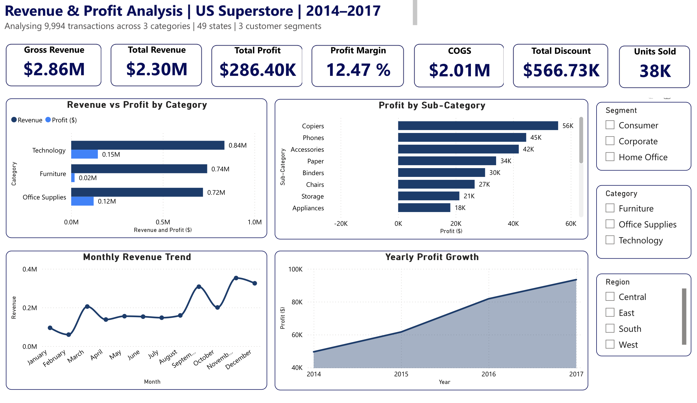

# Revenue & Profit Analysis Dashboard | Power BI

## Overview
An interactive Revenue & Profit Analysis dashboard built using the Superstore Sales dataset, analysing 9,994 transactions across 49 US states, 3 product categories and 3 customer segments from 2014 to 2017.

## Objective
To analyse sales performance and profitability, identify key revenue and profit drivers, evaluate the impact of discounts on business performance, and uncover actionable insights across products, customer segments, regions and time periods.

## Key Metrics
| Metric | Value |
|---|---|
| Gross Revenue | $2.86M |
| Total Revenue | $2.30M |
| Total Profit | $286.40K |
| Profit Margin | 12.47% |
| COGS | $2.01M |
| Total Discounts | $566.73K |
| Units Sold | 38K |

## Insights Covered:
- Revenue vs Profit by Category
- Profit by Sub-Category
- Monthly Revenue Trend
- Yearly Profit Growth
- Interactive filters by Segment, Category and Region

## Key Insights
- Technology is the most profitable category at 17.40% margin while Furniture has the lowest at 2.49%
- Copiers and Phones are the strongest profit-generating sub-categories contributing $56K and $45K respectively
- Consumer segment generates the highest revenue at $1.16M but has the lowest margin at 11.55%

Beyond the findings highlighted above, the dashboard enables deeper insight into revenue, profitability, customer segments, product categories, and regional performance through interactive filters and visualisations.

## Tools Used
- Power BI
- Python (data cleaning and validation)

## DAX Measures Written
- Profit Margin %
- Gross Revenue
- COGS
- Total Discounts

## Key Skills Applied and Developed:
- Designed and Developed an intuitive Power BI dashboard focused on revenue and profitability analysis.
- Created DAX measures such as Profit Margin(%), Gross Revenue, COGS, and Total Discounts.
- Developed interactive filters to support dynamic analysis of performance across customer segments, product categories, regions, and time periods. 
- Transformed raw data into actionable insights for decision-making through effective data visualisation.

## Dataset
[Superstore Sales Dataset - Kaggle](https://www.kaggle.com/datasets/vivek468/superstore-dataset-final)

This project strengthened my understanding of business intelligence, analytics, and dashboard design. I look forward to continuing my learning journey by building more advanced dashboards and analytical solutions. I would greatly appreciate any feedback or suggestions.

## Dashboard Preview

[Watch the interactive demo on LinkedIn] [(https://www.linkedin.com/feed/update/urn:li:activity:7475553157897670656/)]
